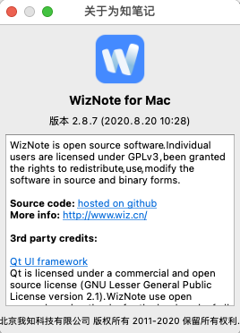

Migrate from WizNote to Joplin.

## !!!CAUTION!!!!

wiz2joplin has only been tested in wizNote for Mac 2.8.7. AFAIK, the folder structure of the macOS and Windows versions of wizNote may be different.

If you can provide a pull request for wizNote of Windows, I believe it will be helpful to many people.

## Dependency

- Python 3.9
- macOS Catalina or above
- wizNote for Mac 2.8.7 (2020.8.20 10:28)
- 

## Installation

To install this tool, you can use pip:

```
python -m venv ~/w2j/venv
source ~/w2j/venv/bin/activate
pip install w2j
```

Alternatively, you can install the package using the bundled setup script:

```
python -m venv ~/w2j/venv
source ~/w2j/venv/bin/activate
python setup.py install
```

## Usage

If your WizNote user id is `youremail@yourdomain.com`, the token in Joplin Web Clipper is `aa630825022a340ecbe5d3e2f25e5f6a`, and Joplin run on the same computer, you can use wiz2joplin like follows.

Convert all of documents from wizNote to Joplin:

``` shell
w2j -o ~/w2j -w ~/.wiznote -u youremail@yourdomain.com -t aa630825022a340ecbe5d3e2f25e5f6a -a
```

Convert location `/My Notes/reading/` and all of the children documents from WizNote to Joplin:

``` shell
w2j -o ~/w2j -w ~/.wiznote -u youremail@yourdomain.com -t aa630825022a340ecbe5d3e2f25e5f6a -l '/My Note/reading/' -r

```

Use `w2j --help` to show usage for w2j:

```
usage: w2j [-h] --output OUTPUT --wiz-dir WIZNOTE_DIR --wiz-user
           WIZNOTE_USER_ID --joplin-token JOPLIN_TOKEN
           [--joplin-host JOPLIN_HOST] [--joplin-port JOPLIN_PORT]
           [--location LOCATION] [--location-children] [--all]

Migrate from WizNote to Joplin.

optional arguments:
  -h, --help            show this help message and exit
  --output OUTPUT, -o OUTPUT
                        The output dir for unziped WizNote file and log file.
                        e.g. ~/wiz2joplin_output or
                        C:\Users\zrong\wiz2joplin_output
  --wiz-dir WIZNOTE_DIR, -w WIZNOTE_DIR
                        Set the data dir of WizNote. e.g ~/.wiznote or
                        C:\Program Files\WizNote
  --wiz-user WIZNOTE_USER_ID, -u WIZNOTE_USER_ID
                        Set your user id(login email) of WizNote.
  --joplin-token JOPLIN_TOKEN, -t JOPLIN_TOKEN
                        Set the authorization token to access Joplin Web
                        Clipper Service.
  --joplin-host JOPLIN_HOST, -n JOPLIN_HOST
                        Set the host of your Joplin Web Clipper Service,
                        default is 127.0.0.1
  --joplin-port JOPLIN_PORT, -p JOPLIN_PORT
                        Set the port of your Joplin Web Clipper Service,
                        default is 41184
  --location LOCATION, -l LOCATION
                        Convert the location of WizNote, e.g. /My Notes/. If
                        you use the --all parameter, then skip --location
                        parameter.
  --location-children, -r
                        Use with --location parameter, convert all children
                        location of --location.
  --all, -a             Convert all documents of your WizNote.
```

## Log file

Please read log file `w2j.log` under --output directory to check the conversion states.

## 源码分析相关文章

- [从 WizNote 为知笔记到 Joplin（上）](https://blog.zengrong.net/post/wiznote2joplin1/)
- [从 WizNote 为知笔记到 Joplin（下）](https://blog.zengrong.net/post/wiznote2joplin2/)
- [WizNote 为知笔记 macOS 本地文件夹分析](https://blog.zengrong.net/post/analysis-of-wiznote/)
- [使用腾讯云对象存储(COS)实现Joplin同步](https://blog.zengrong.net/post/joplin-sync-use-cos/)
- [配置 Joplin Server 实现同步](https://blog.zengrong.net/post/joplin-server-config/)
